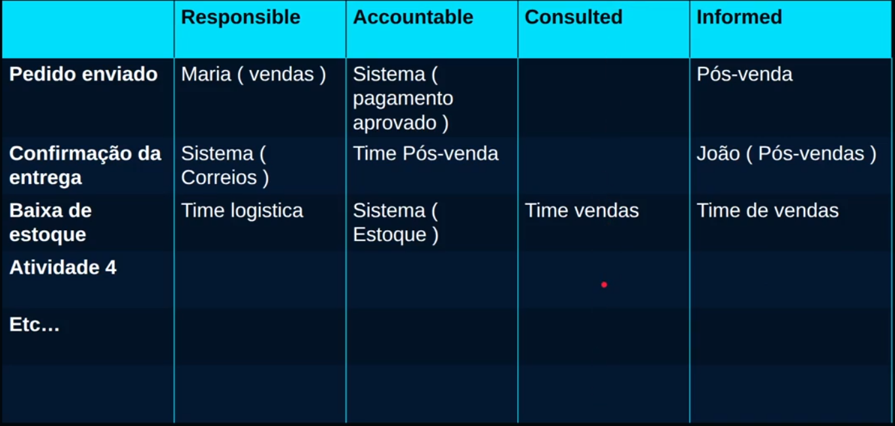

# Responsáveis e Regras

## Regras

O que precisa acontecer se/quando algo foge do normal?

- "Se o candidato não enviar os
documentos... para processo"
- "Se pagamento for reprovado... solicitar
outro método"
- "Se estoque < 3... disparar alerta"

## Responsável

Cada atividade precisa ter um dono. Senão o processo trava.

- Uma Pessoa
- Um Time
- Um Sistema

## Matriz RACI

Tabela para demonstrativos de como usar o RACI

### Responsible

Quem faz o trabalho, executa a atividade.

### Accountable

Quem assume a responsabilidade final, aprova e responde pelo resultado.

### Consulted

Quem precisa ser ouvido antes da atividade acontecer.

### Informed

Quem precisa ser informado do que está acontecendo.

## VSM (Value Stream Mapping)

O VSM é uma ferramenta utilizada para mapear e analisar o fluxo de valor de um processo, permitindo identificar etapas que agregam valor, desperdícios, gargalos e oportunidades de melhoria.

Seu foco está na compreensão do fluxo de materiais e informações ao longo do processo, auxiliando na otimização operacional e na tomada de decisões estratégicas.

Vale ressaltar que, embora contribua significativamente para o entendimento dos processos, sua aplicação pode se tornar mais complexa em ambientes com alta variabilidade, devido à dificuldade de padronização e análise consistente dos fluxos.
